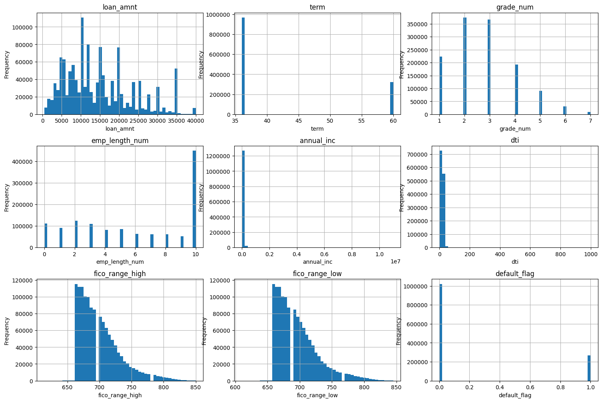
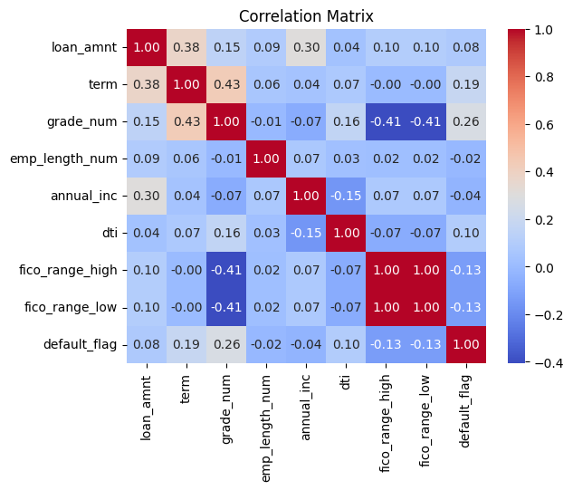
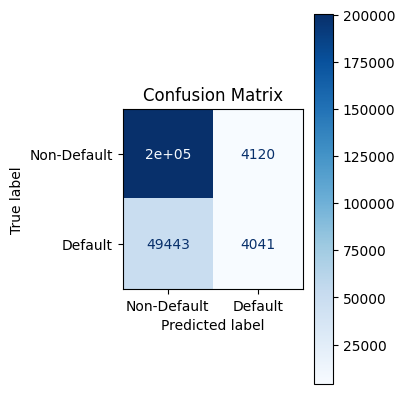
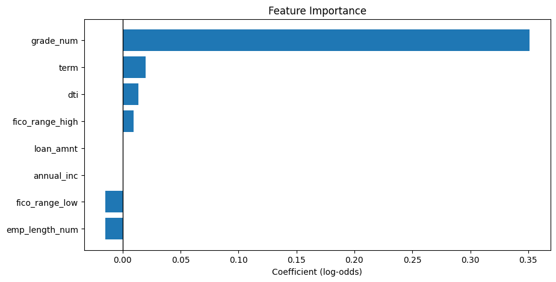

# Loan Default Risk Prediction Model

**Author:** Daniel (Euichan) Kim

## Introduction
In the financial sector, a key challenge is accurately assessing the risk of loan default. This project addresses that challenge by building a **logistic regression** model to predict the probability that an accepted loan will be paid back or defaulted on.

The data used for this project is from Lending Club and was sourced from [Kaggle](https://www.kaggle.com/datasets/wordsforthewise/lending-club). The goal is to provide a data-driven tool that helps financial institutions better understand their current portfolio risk and supports informed decision-making for future lending strategies.

## Demo Walkthrough

## Technical Stack
- **Python**: Primary language for data processing and model building
- **NumPy & pandas**: Data manipulation, analysis, and numerical operations
- **scikit-learn**: Logistic regression model building and evaluation
- **matplotlib & seaborn**: Visualizations for Exploratory Data Analysis (EDA)

## Project Structure & Methodology

The project follows a standard data science workflow, from **data preparation** to **model evaluation**.

### 1. Data Wrangling
The initial dataset was loaded, and crucial data cleaning steps were performed. This included converting key categorical features into a numerical format suitable for modeling:

- **term**: Converted from `'36 months'` or `'60 months'` to `36.0` or `60.0`
- **emp_length**: Converted to numerical, with `'< 1 year' = 0` and `'10+ years' = 10`
- **grade**: Letter grade mapped to a numerical value; higher number indicates a worse grade

### 2. Exploratory Data Analysis (EDA)
The cleaned data was analyzed to identify trends and relationships. Key visualizations were created to explore the data:

| Visualization        | Description | Chart |
|----------------------|----------|---------|
| **Default Counts**    | Bar chart showing imbalance: majority of loans paid off vs defaults |  |
| **Feature Distributions** | Histograms and box plots for `loan_amnt`, `annual_inc`, and `dti` |  |
| **Correlation Analysis** | Heatmap showing relationships between variables, e.g., negative correlation between `grade_num` and `fico_range_high`/`fico_range_low` and positive correlation between `loan_amnt` and `term` |  |

*Suggested: Add images of charts here for better visual presentation.*

### 3. Modeling & Evaluation
A logistic regression model was trained on the preprocessed data to predict the default status. The model's performance was evaluated using several key metrics:

- **ROC Curve & AUC Score**: The Area Under the Curve (AUC) score was calculated to measure the model's ability to distinguish between defaulted and non-defaulted loans. An AUC of **0.70** indicates a reasonably strong predictive capability.
- **Confusion Matrix**: A confusion matrix was generated to show the counts of true positive, true negative, false positive, and false negative predictions, providing a clear picture of the model's accuracy.
- **Feature Coefficients**: A plot of the model's feature coefficients revealed the importance of each variable. Features with the largest absolute coefficients, such as `grade_num` and `term`, had the strongest impact on the predicted default risk.

|  |  |  |
|------|------|-----|

## References
- **Jupyter Notebook:** [Link to notebook](loan_default_risk_prediction.ipynb)  
- **Demo Website:** [Link to demo](https://loan-default-risk-project.streamlit.app/)
